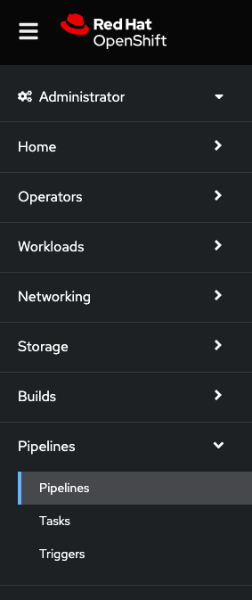

:guid: %guid%,
:openshift_cluster_console_url: %openshift_cluster_console_url%,
:openshift_cluster_admin_username: %openshift_cluster_admin_username%,
:openshift_cluster_admin_password: %openshift_cluster_admin_password%,
:globex_ui: %app_dev_url%,

=== Exploring your pipelines

This workshop has provisioned 2 piplines for you.  In this section, we will take a closer look at them:

[arabic]
. Go to the %openshift_cluster_console_url%/[OpenShift
console] and log in with your credentials username: %openshift_cluster_admin_username% and password: %openshift_cluster_admin_password%.
+
image:images/openshift-login.png[images/openshift-login.png]
. Upon successful login, you will see the Red Hat OpenShift Dedicated environment. This is a kubernetes platform from which you can create containerized applications. As part of this environment is the *Openshift Piplines* installation.  You can access this by clicking *Pipelines* on the left menu and click *Pipelines* in the submenu.
+

. Filter for the *software-supply-chain* project on the projects list.
. You should see the 2 pipelines configured for this workshop.

+
.. *app-globex-ui-pipeline* - The main pipeline used to demonstrate image signing:

... Fetches source code
... Builds a container image from this source code
... Runs ACS policy build time checks against this container image
... Runs an ACS image scans against this container image for any vulnerabilities
... Updates a deployment file in a gitops repository, monitored by Openshift Gitops, with the updated image.  Any changes made to this repository are then synced to the cluster i.e. a deployment of your new image.
.. *app-globex-ui-unsigned-pipeline* - A pipeline highlighting the scenario of building and deploying unsigned images:

... Fetches the same source code
... Builds a container image from this code
... Updates another deployment file, in the gitops repository, with the unsigned image.
... Runs build time checks against ACS for policy violations.
+
These two pipelines have already run and should both be completed.  Image signing and signature verification are not yet enabled.
. Click on the globex app link below:
+
link:%globex_ui%[Globex]
+
The front end you’re viewing now is the deployed container image the pipeline app-globex-ui-pipeline has built.
