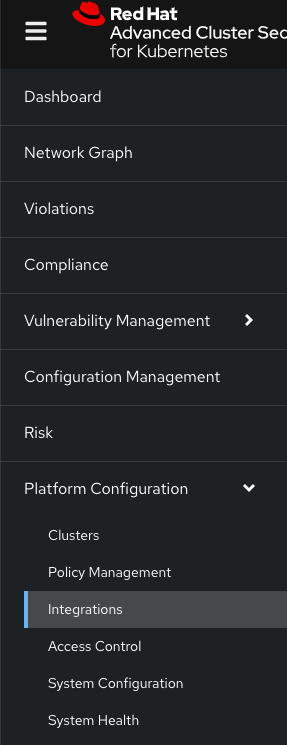
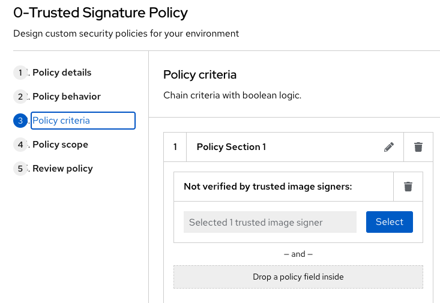

:guid: %guid%,
:bastion_public_hostname: %bastion_public_hostname%,
:bastion_ssh_password: %bastion_ssh_password%,
:bastion_ssh_user_name: %bastion_ssh_user_name%,
:rhacs_console_url: %rhacs_console_url%
:rhacs_admin_user_name: %rhacs_admin_user_name%
:rhacs_admin_password: %rhacs_admin_password%

[arabic]
In this section of the workshop, we will introduce Tekton Chains, which enables image signing in our pipelines i.e. any image built in our pipeline will be signed using a private key.  A public key will be used to verify signatures.  Tekton has a few options available to sign your images:

* x509
* Cosign
* KMS
* EXPERIMENTAL: Keyless signing

In this workshop, we will be using Cosign.
To get started signing things in Chains, you must generate a keypair and instruct Chains to sign with it via an Openshift secret. Chains expect a private key and password, if the key is encrypted, to exist in a Kubernetes secret signing-secrets in the openshift-pipelines namespace.

. Login into your bastion server by executing the below command:
+
[source, subs="attributes", role="execute"]
----
ssh -o StrictHostKeyChecking=no -o ServerAliveInterval=30 %bastion_ssh_user_name%@%bastion_public_hostname%
----
+
Use the following password:
+
[source, subs="attributes", role="execute"]
----
%bastion_ssh_password%
----
+
. Configure Tekton Chains by running the below commands:
+
[source, role="execute"]
----
cd
cat <<EOF >> chains.yaml
apiVersion: operator.tekton.dev/v1alpha1
kind: TektonChain
metadata:
  name: chain
spec:
  artifacts.oci.storage: oci
  artifacts.taskrun.format: in-toto
  artifacts.taskrun.storage: oci
  config: {}
  targetNamespace: openshift-pipelines
  transparency.enabled: true
EOF
oc apply -f chains.yaml
----
+
. Run the next command a few times to check if the deployment is available:
+
[source, role="execute"]
----
oc get deployment tekton-chains-controller -n openshift-pipelines
----
Wait for the *AVAILABLE* column to display *1*
+
[source]
----
NAME                       READY   UP-TO-DATE   AVAILABLE   AGE
tekton-chains-controller   1/1     1            1           106m
----
. Once the deployment is available, run the following command to create a secret called signing-secrets in the openshift-pipelines namespace which Chains will use to sign your images:
+
[source, role="execute"]
----
COSIGN_PASSWORD=openshift cosign generate-key-pair k8s://openshift-pipelines/signing-secrets
----
+
. A public key will be created in your home directory called cosign.pub.  This key is used for image signature verification.  Print the public key:
+
[source, role="execute"]
----
cat cosign.pub
----
Take note of the key as you will need it to copy it later to configure a Signature Integration in RHACS.
. Go to the %rhacs_console_url%/[RHACS
console] and log in with your credentials username: *%rhacs_admin_user_name%* and password: *%rhacs_admin_password%*.

+
. On the left menu, select *Platform Configuration > Integrations*
+

. On the *Integrations* screen, select *Signature Integrations*
+

. On the *Signature Integrations*, click the button *New integration*
.. For *Integration name* enter *cosign*
.. Expand the *Cosign* field and select *Add new public key*
.. For *Public key name* enter *cosign.pub*
.. For *Public key value* copy the public key from the terminal and paste it in this field.  This is used by RHACS to verify your image signatures.
.. Click save
+

+
. For convenience, we have already set up a policy in ACS called “Trusted Signature Policy” that checks an image for a valid signature.  This policy is enforced during the below lifecycle stages:
.. Build  - Runs when doing a roxctl image check on an image.  This will trigger a violation if the image passed to the command is not signed with our signature.
.. Deployment - Will prevent deployments to Openshift if images are not signed with our signature
+
This policy is currently disabled.
+
. On the left menu, select *Platform Configuration > Policy Management*
+

+
. The policy you are looking for is called *0-Trusted Signature Policy*.  It should be at the top of the list.
+
image:images/rhacs-policy-management-list.png[images/rhacs-policy-management-list.png]
. Click the ellipse at the end and select *Edit policy*.
+

+
. Select *Policy criteria* and then click the *Select* button.
+

+
. Select the cosign signature integration and click save.
+

+
. Continue clicking next at the bottom until you finally save the policy.
. Now that the policy is updated, we want to enable it.  Click the ellipse again for the same policy and select *Enable policy*
+

