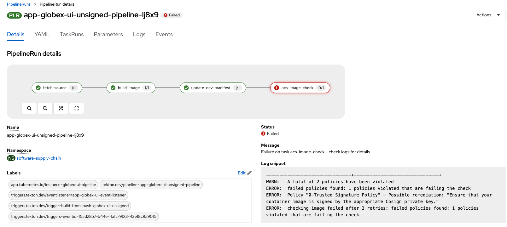

:markup-in-source: verbatim,attributes,quotes

In this section we will investigate the results of the changes you've made in Openshift to enable image signing.  You should still be on the Pipelines screen in the project *software-supply-chain* from the the previous screen.

. Wait until the *app-globex-ui-pipeline* pipeline runs to completion.  This pipeline run would have signed our image and the RHACS check would be still be successful since the policy you enabled verified your image.
[NOTE]
The RHACS image check step will only fail now if the image is not signed with your generated key.
. Tekton Chains will create annotations on your TaskRun when signing your images.  This is a confirmation that your image was signed during this step in your pipeline.  The annotations to look out for are *chains.tekton.dev/signed* and *chains.tekton.dev/transparency*. To take a look at these annotations run the following command:
+
[source, role="execute"]
----
cd
TASKRUN=$(oc get taskrun -n software-supply-chain --sort-by={metadata.creationTimestamp} | grep app-globex-ui-pipeline | grep build-image | tail -1 | awk '{print $1}')
oc get taskrun $TASKRUN -n software-supply-chain -o json | jq '.metadata.annotations'
----
+
. Switch back to your Openshift console and click *Pipelines > Pipelines*.  The *app-globex-ui-unsigned-pipeline* run has failed.  Click on the pipeline run and you will see there is a failure on the acs image check.  The error shows that the signature on the image cannot be verified. This pipeline was intentionally configured not to sign your image during the *build-image* task.
+

. Select *Workloads > Deployments* on the left menu and change the project to globex.
+

. Delete the deployment *globex-ui-unsigned* and wait a few seconds for it to recreate.
. Click the new generated deployment *globex-ui-unsigned* and open the *Events* tab.  You will notice that a warning has been generated by the admission controller which has prevented deployment due to a policy violation as the image you’re trying to deploy is untrused.
+

. You can also use the Cosign CLI to verify your image signatures.  Run the following command to verify your latest built image with the Cosign public key you generated earlier:
+
[source, role="execute"]
----
cd
IMAGE=$(oc get deployment globex-ui -n globex -o json | jq -r '.spec.template.spec.containers[0].image')
cosign verify --key=cosign.pub $IMAGE
----
[NOTE]
If you receive the error *Error: no matching signatures*, wait 15 seconds and retry the above command.  It is possible that Openshift Gitops has not yet synced your signed image to the cluster.
