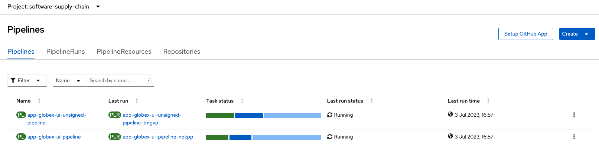

:guid: %guid%,
:gitea_repo_url: %gitea_repo_url%,

[arabic]
To get our pipeline to sign our image, we need to trigger a new pipeline run.  To do this we need to update a file in our source code repository.  This change will initiate a webhook call that will trigger a run of our pipeline.

. Run the below command to clone the source code repository to your lab environment:
+
[source, role="execute"]
----
cd
rm -rf globex-ui
git clone `+%gitea_repo_url%+`
----
. Make a change to README.md file in the source code:
+
[source, role="execute"]
----
cd globex-ui
echo "Making a change..." >> README.md
----
. Stage your changes:
+
[source, role="execute"]
----
git add .
----
. Commit your changes:
+
[source, role="execute"]
----
git commit -m "Some text added..."
----
. Push your changes back to the repository
+
[source, role="execute"]
----
git push
----
. Switch back to your Openshift Console and select *Pipelines > Pipelines* from the left menu and ensure that the project is *software-supply-chain*.  Your changes would have triggered 2 new pipeline runs.
+
