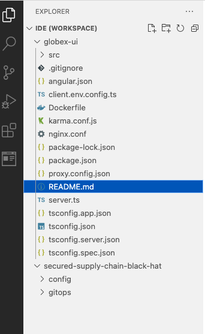
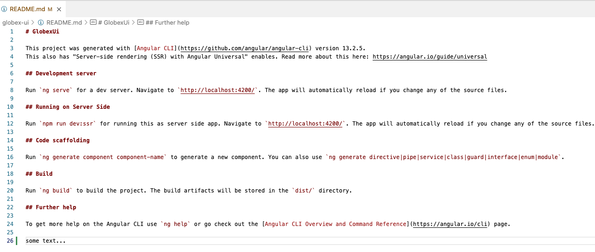
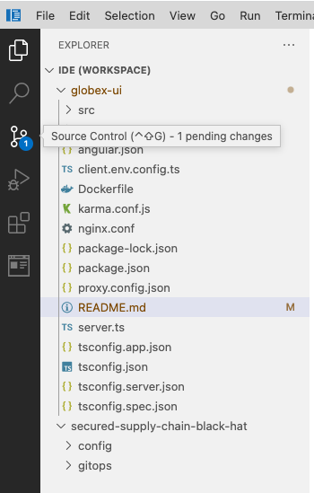
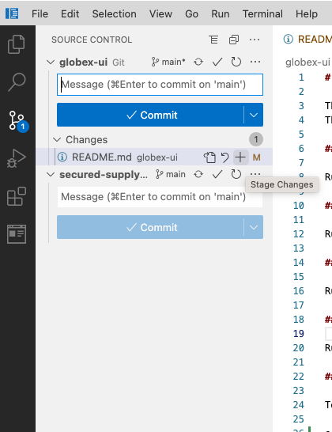
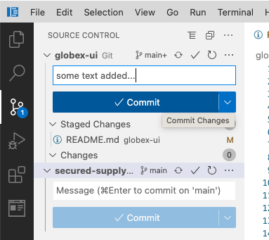
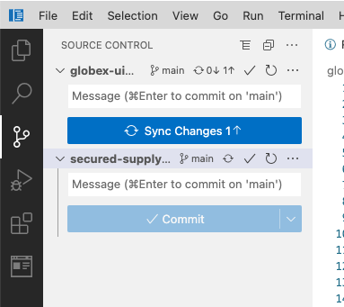
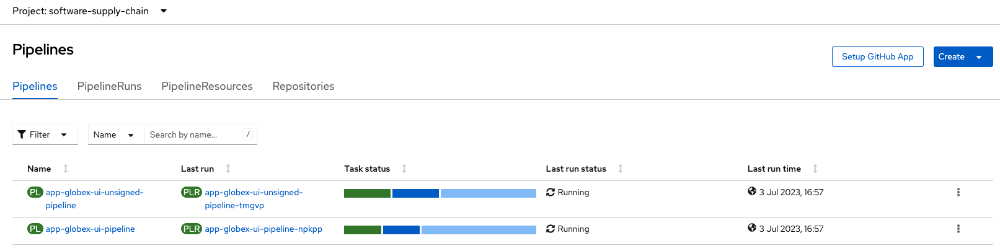

:guid: %guid%,
:code_server_url: %code_server_url%,
:code_server_password: %code_server_password%,

[arabic]
. Login to %code_server_url%/[Code Server] with the password *%code_server_password%*.
+
image:images/codeserver-login.png[images/codeserver-login.png]
. Locate the globex-ui project on the left side and open the README.md file
+

. Add some text to the end of this file.
+

. Click *File > Save*
. Click the *Source Control* icon on the left pane
+

. Stage your changes by clicking the *+* sign next to the README.md file
+

. Enter a comment for your commit and press the *Commit* button
+

. Sync your changes with the *Sync Changes* button
+

. Switch back to your Openshift Console and select *Pipelines > Pipelines* from the left menu and ensure that the project is *software-supply-chain*.  Your changes would have triggered 2 new pipeline runs.
+
