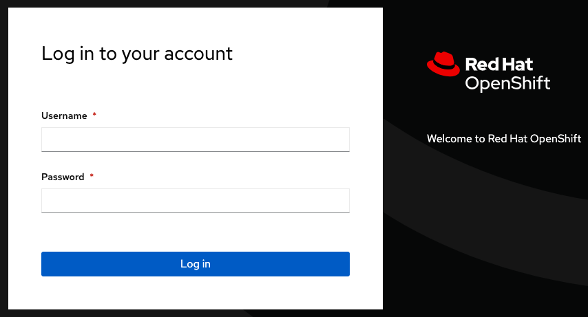

:guid: %guid%,
:openshift_cluster_console_url: %openshift_cluster_console_url%,
:openshift_cluster_admin_username: %openshift_cluster_admin_username%,
:openshift_cluster_admin_password: %openshift_cluster_admin_password%,

=== Failover Application To Secondary

[arabic]
. Open a terminal, login to the primary cluster %api_url% with your credentials username: %openshift_cluster_admin_username% and password: %openshift_cluster_admin_password%.
+
[source, bash]
----
oc login -u %openshift_cluster_admin_username% -p %openshift_cluster_admin_password% https://api.cluster-x9sc5-2.sandbox2623.opentlc.com:6443
----
+
. You are now going to make an update to the price of one of the globex store items.  This data is stored in a postgres database attached to a PVC which we will preserve during the failover.  Update the price by running the below commands:
+
[source, bash]
----
POD=$(oc get pods -n globex | grep catalog-database | awk '{print $1}')
oc exec -it pod/$POD -n globex -- psql --dbname catalog --command "update catalog set price = 15 where name = 'Quarkus T-shirt';"
----
+
. Switch back to the Globex application and refresh the page.  Select the last page (6) and notice that the price of the Quarkust T-shirt is now *$15.00*
+
image:images/primary-globex-item-updated.png[images/primary-globex-item-updated.png]
+
. Return to the RHACM console and then click *Data Services->Data policies* from the left menu.
+
image:images/rhacm-data-policies.png[images/rhacm-data-policies.png]
+
. Click on the 3 dots on the *drsync5m* disaster recovery policy and select *Apply DRPolicy*.
image:images/rhacm-apply-dr-policy.png[imagesrhacm-apply-dr-policy.png]
+
. On the *Apply DRPolicy* popup, select the *globex* application and under *PVC label* enter *app=globex*.  These options allow the globex application to be included in the DR policy and preserves any PVC's with a label matching *app=globex*, in our case the PVC associated with the postgres database containing our prices.  Click *Apply*.
+
image:images/rhacm-save-dr-policy.png[images/rhacm-save-dr-policy.png]
+
. Open a terminal, login to the secondary cluster %api_url% with your credentials username: %openshift_cluster_admin_username% and password: %openshift_cluster_admin_password%.
+
[source, bash]
----
oc login -u %openshift_cluster_admin_username% -p %openshift_cluster_admin_password% https://api.cluster-x9sc5-2.sandbox2623.opentlc.com:6443
----
+
. You will now need to create the *globex* namespace in the secondary cluster and annotate it with the globex subscription name.
+
[source, bash]
----
oc new-project globex || oc project globex
oc annotate ns globex --overwrite=true apps.open-cluster-management.io/hosting-subscription=globex/globex-subscription-1
----
+
. Switch back to the RHACM console and select *Applications* and filter on *Subscription*.  Click the 3 dots at the end of the *globex* application and select *Failover application*.
+
image:images/rhacm-failover-menu.png[images/rhacm-failover-menu.png]
+
. Provide the following details on the popup:
.. *Select policy*: drsync5m
.. *Target cluster*: secondary
.. *Select subscriptions group*: globex-subscription-1
+
image:images/rhacm-failover-application.png[images/rhacm-failover-application.png]
+
NOTE: The subscription group may not be in a ready state to select.  Wait a few minutes and try again.
.. Click *Initiate*
. You will notice that the pods on the primary cluster in the *globex* namespace will start terminating as the app starts failing over.
+
image:images/primary-pods-terminated.png[images/primary-pods-terminated.png]
+
. Open another browser window and login to the *secondary* cluster %openshift_cluster_console_url%/[OpenShift
console] and log in with your credentials username: %openshift_cluster_admin_username% and password: %openshift_cluster_admin_password%.
+

+
. Once logged in click *Workloads->Pods* on the left menu.  Ensure your selected project is *globex*.  Notice that the application pods have been recreated in this namespace.
+
image:images/secondary-pods-created.png[images/secondary-pods-created.png]
+
. Next, click *Networking->Routes* on the left menu and then click on the *Location* link of the *globex-ui* route.
+
image:images/secondary-globex-route.png[images/secondary-globex-route.png]
+
. Once you've clicked the link you will be redirected to globex online store front end.  Select *Cool Stuff Store* at the top of the page.
+
image:images/primary-globex-landing.png[images/primary-globex-landing.png]
+
. Select the last page (6) and notice that the price of the Quarkust T-shirt is *$15.00*.  Our data from the primary cluster has been preserved during the failover.
+
image:images/secondary-price-preserved.png[images/secondary-price-preserved.png]
